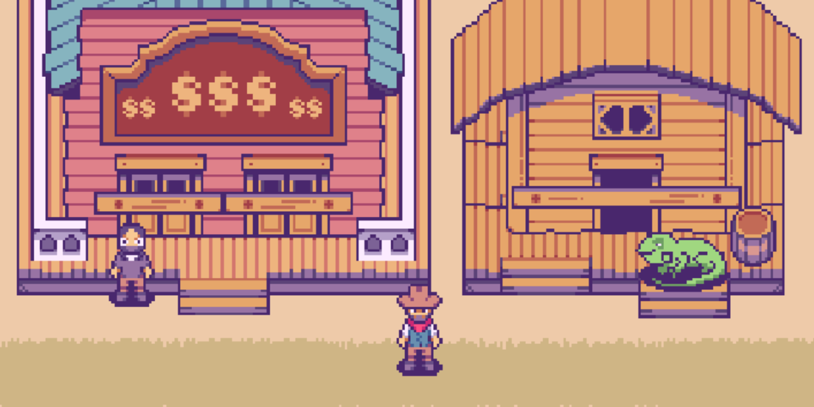

<h1 align="center">
  
    
  :cowboy_hat_face:  :cowboy_hat_face:  :cowboy_hat_face: HIGHWAYMAN :cowboy_hat_face:  :cowboy_hat_face:  :cowboy_hat_face:
  </h1>

<h4 align="center">:test_tube: Status do Projeto: Fase de Testes :test_tube:</h4>
<h1></h1> 

<h4 align="center">
 <a href="#motivacao">Motivação</a> •
 <a href="#premissa">Premissa</a> • 
 <a href="#tutorial">Tutorial para Execução</a> • 
 <a href="#devs">Desenvolvedores</a> • 
 <a href="#creditos">Créditos</a>
</h4> 

<h2 id="motivacao">:cowboy_hat_face: Motivação:</h3>

 Afim de cumprir com a proposta de um Projeto Final para a matéria de INF112, o nosso grupo decidiu criar um jogo na linguagem C++ (utilizada em nossas aulas) utilizando a biblioteca Allegro (já utilizada na matéria de Programação 1) de modo a aplicarmos alguns conceitos estudados nas aulas, como classes e objetos, herança e composição, entre outros, bem como boas práticas de programação.

 

<h2 id="premissa">:cowboy_hat_face: Premissa:</h3>

 Highwayman é um jogo contextualizado no velho oeste com elementos de RPG no qual você deverá defender uma vila da invasão de uma gangue de pistoleiros. Converse com aldeões, encontre itens escondidos pelo mapa e desafie personagens para duelos nessa divertida aventura!

 

 

<h2 id="tutorial">:cowboy_hat_face: Tutorial para Execução:</h3>
<h3 align="center"> :rotating_light: ATENÇÃO: esse tutorial é válido apenas para Windows. :rotating_light: </h3> 

 Howdy, partner! Para jogar Highwayman, é necessário, além de baixar os arquivos compactados pelo GitHub, acrescentar o MinGW - um software que inclui cabeçalhos que serão interpretados pelo GCC 🤔, o compilador - que será adicionado as variáveis de ambiente do Windows.

  
<b>:cowboy_hat_face: BAIXAR OS ARQUIVOS</b>  

Para baixar os arquivos em seu computador, vá em Code -> Download ZIP e salve o arquivo compactado onde desejar! 

 

Depois, clique com o botão direito direto do mouse nele e selecione <b>"Extrair aqui"</b>.
 

  

<b>:cowboy_hat_face: ADIÇÃO DO MINGW NAS VARIÁVEIS DE AMBIENTE</b>  

Se esta parte lhe parece muito técnica, não se preocupe! Para isso, você não precisar ter o gatilho mais rápido do velho oeste! Acesse <b>https://drive.google.com/drive/folders/1bauTrrAK9UKedWnj19keHuFpxH_UX67X?usp=sharing</b> e faça o download do arquivo compactado que deixamos lá para você! (Não se preocupe se o Google lhe fornecer um aviso, caubói, o arquivo é grande demais para a carroça do GitHub e para o Google verificar se há virús, mas juramos que ele não faz mal).
 

 

Ao realizar o mesmo processo de extração que fizemos para o arquivo "20212-team-4-main", haverá uma pasta chamada "mingw64". Abra-a, vá para o diretório <b>bin</b> e copie o endereço desta pasta.
 

 

 

Busque por <b>"Editar as Variáveis de Ambiente"</b>, clique em <b>"Variáveis de Ambiente..."</b> e dê dois cliques na repatição <b>"Path"</b> de <b>"Variáveis de usuário para Usuário"</b>.
 

 

 

Clique em novo e cole no campo de texto o endereço copiado! Se quiser, selecione o endereço que você acabou de colar e clique em <b>"Mover para Cima"</b> até ficar no topo da lista. Por final, selecione <b>OK -> OK -> Aplicar -> OK </b>.
 

 

Prontinho! O MinGW já está configurado e você já pode jogar! IHAAA! :cowboy_hat_face:
 

<b>:cowboy_hat_face: E SE EU NÃO QUISER MAIS O MINGW?</b> 

É simples! Basta desfazer o processo! Vá novamente para Variáveis de <b>Ambiente -> Path</b>, selecione o endereço da página onde está o bin do MinGW e clique em Excluir e, depois, <b>OK -> OK -> Aplicar -> OK</b>. Agora, basta excluir a pasta que você criou para guardar os arquivos do jogo e do MinGW e está feito!

  
<b>:cowboy_hat_face: EXECUTAR O JOGO</b>  

Para executar o jogo no seu computador, basta procurar pela pasta em que você descompactou os arquivos, clicar em "jogo" e, então, sua aventura começará!

 

<h2 id="devs">:cowboy_hat_face: Desenvolvedores:</h3>

 

<h2 id="creditos">:cowboy_hat_face: Créditos:</h3>
<ul>
  <li><a href="https://bakudas.itch.io/generic-oldwest-pack">Sprites das imagens</a></li>
  <li><a href="https://www.youtube.com/watch?v=hBMmoqdahpc">Highwayman - The Highwaymen (Instrumental)</a></li>
  <li><a href="https://www.youtube.com/watch?v=AFa1-kciCb4">Main Title (From “The Good, The Bad And The Ugly") - The City of Prague Philharmonic Orchestra</a></li>
  <li><a href="https://www.youtube.com/watch?v=-MK5ChLJTAk">American Venom - Rockstar</a></li>
  <li><a href="https://www.youtube.com/watch?v=lAGm9MTyRJ8">Eyes of the Wolf - CD Project Red</a></li>
  <li><a href="https://www.youtube.com/watch?v=fwsYlTbdKtM">Kyrie - Guilherme Arantes</a></li>
  <li><a href="https://www.youtube.com/watch?v=qBrSvLZ-NpU">Ghost Riders In The Sky - Stan Jones (Instrumental)</a></li>
</ul>
